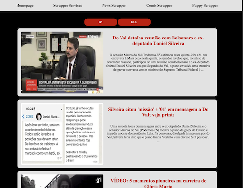

# Disclaimer: This project has been discontinued for now. Currently, my ip address seems to be blocked from making requests on G1 and UOL :laughing:, which was expected. But it was fun while it lasted. If you test this project remember that this might happen and can be fixed but I would not advise to do so, as to not overload their servers. This repo might still be used for learning purposes as a base for making requests where it won't affect a day to day application like those. This is best applied on a a free api, for example

## Black box app (name may change)

-   Doing this for fun and currently making a news scrapper but I wanna test various things with this app as personal project. Including NextJS which is cool
-   Feel free to fork this project if you want to use as a base for you own or contribute to the current repo as well

## How to run this app locally:

Clone the repository:
`git clone https://github.com/<your-username>/black-box.git`

Install dependencies:
`npm install or yarn install`

Run the development server:
`npm run dev or yarn dev`

The application will be available at http://localhost:3000.

To build the application for production, run:
`npm run build or yarn build`

To start the application in production, run:
`npm start or yarn start`

Lint the code:
`npm run lint or yarn lint`

For now there is no need for environmental variables

## Work in progress. Current app status on Feb 2nd 2023:

  

## TODO / Roadmap:

-   priority: refactor app for scalability before adding more news sources
-   priority: fix how RenderNewsCard is rendering the image on the card when there is no image available from source

-   create more tests
-   add other news sources (terra, metropole, r7, cnn, folha, estadao, veja, bcc) - based on popular sites and third-party feedback
-   ~~Header containing links to homepage and other pages~~
-   ~~CSS of news cards~~ (done for prototype)
-   ~~Info about install/run/deploy/contribute/etc on this README~~
-   filter the news based on the person's location. for now I'm fetching from the frontpage so it gets news from different states
-   eslint/prettier config with airbnb - already have eslint default
-   dotenv when necesarry - which it'll be eventually
-   add material ui - MUI - so that my project isnt the ugly blob it always is xD - at least chaptGPT did good on the color pallete
-   search input for keywords and to search news by a date/timeframe
-   ..

// some reference links:

-   [G1](g1.globo.com)
-   [UOL](https://noticias.uol.com.br/)
-   [UOL api](https://api.uol.com.br/#UsandoOAuth2.0paraacessarasAPIsdoUOL-5-ComochamarumaAPIUOL)
